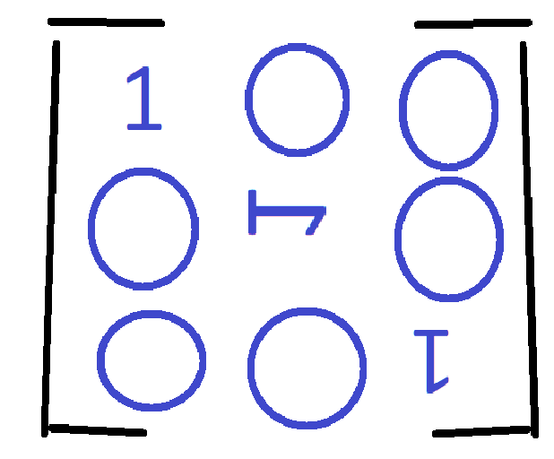

# Matrix Solver

<div align="center">



**A powerful interactive tool for solving linear algebra problems with step-by-step visualization**

[](https://choosealicense.com/licenses/mit/)
[](https://reactjs.org/)
[](https://www.typescriptlang.org/)
[](https://vitejs.dev/)

[Report Bug](https://github.com/rachelannec/matrix-solver/issues/new?labels=bug&template=bug_report.md) | [Request Feature](https://github.com/rachelannec/matrix-solver/issues/new?labels=enhancement&template=feature_request.md)

</div>

---

## 📋 Table of Contents

- [About](#about)
- [Features](#features)
- [Demo](#demo)
- [Getting Started](#getting-started)
  - [Prerequisites](#prerequisites)
  - [Installation](#installation)
  - [Running the App](#running-the-app)
- [Usage](#usage)
- [Operations](#operations)
- [Technologies Used](#technologies-used)
- [Project Structure](#project-structure)
- [Contributing](#contributing)
- [License](#license)
- [Acknowledgments](#acknowledgments)

---

## 🎯 About

**Matrix Solver** is an educational tool designed to help students, educators, and professionals understand linear algebra concepts through interactive visualization. The application provides detailed step-by-step solutions for common matrix operations, making it easier to learn and verify calculations.

### Why Matrix Solver?

- 📚 **Educational Focus**: Each step is explained in detail with mathematical notation
- 🎨 **Beautiful Visualization**: Clean UI with LaTeX rendering powered by MathJax
- 🔄 **Interactive Steps**: Navigate through each step to understand the process
- 💡 **Multiple Operations**: Supports various matrix operations in one place
- 📱 **Responsive Design**: Works seamlessly on desktop and mobile devices

---

## ✨ Features

### Core Operations

- ✅ **Gaussian Elimination** - Transform matrices to Row Echelon Form (REF)
- ✅ **Gauss-Jordan Elimination** - Reduce matrices to Reduced Row Echelon Form (RREF)
- ✅ **Determinant Calculation** - Compute determinants using row operations
- ✅ **Matrix Inverse** - Find inverse matrices with step-by-step process

### User Experience

- 🎨 **LaTeX Rendering** - Beautiful mathematical notation
- 📊 **Step-by-Step Visualization** - See each operation performed
- 🔢 **Fraction Support** - Displays results as fractions when possible
- 🎯 **Row Highlighting** - Visual feedback for current operations
- 📱 **Responsive Design** - Works on all screen sizes
- 🌙 **Clean Interface** - Intuitive and easy to use

### Additional Features

- 📖 **Built-in Tutorial** - Learn how to use each operation
- 🎓 **Educational Explanations** - Understand the "why" behind each step
- 💾 **Dynamic Matrix Input** - Flexible matrix size configuration
- ⚡ **Fast Performance** - Instant calculations and smooth animations

---

## 🎬 Demo

### Gaussian Elimination Example

```
Input Matrix:
[ 1  2  4 ]
[ 3  4  10]

Output (Row Echelon Form):
[ 1  0  2 ]
[ 0  1  1 ]

Solution: x = 2, y = 1
```

### Available Operations

| Operation | Input Required | Output |
|-----------|---------------|--------|
| Gaussian Elimination | Any matrix | Row Echelon Form (REF) |
| Gauss-Jordan | Any matrix | Reduced Row Echelon Form (RREF) |
| Determinant | Square matrix | Single number (det value) |
| Matrix Inverse | Square matrix | Inverse matrix A⁻¹ |

---

## 🚀 Getting Started

### Prerequisites

Make sure you have the following installed:

- **Node.js** (v16.0 or higher)
- **npm** (v8.0 or higher) or **yarn**

```bash
# Check your versions
node --version
npm --version
```

### Installation

1. **Clone the repository**

```bash
git clone https://github.com/rachelannec/matrix-solver.git
cd matrix-solver
```

2. **Install dependencies**

```bash
npm install
# or
yarn install
```

### Running the App

**Development Mode:**

```bash
npm run dev
# or
yarn dev
```

The app will be available at `http://localhost:5173`

**Production Build:**

```bash
npm run build
# or
yarn build
```

**Preview Production Build:**

```bash
npm run preview
# or
yarn preview
```

---

## 📖 Usage

### Basic Workflow

1. **Select Operation**
   - Choose from Gaussian Elimination, Gauss-Jordan, Determinant, or Inverse

2. **Configure Matrix**
   - Enter the number of rows and columns
   - Click "Set Dimensions"

3. **Input Values**
   - Fill in your matrix values
   - Use fractions (e.g., 1/3) or decimals

4. **Solve**
   - Click "Solve Matrix"
   - Navigate through the step-by-step solution

### Example: Solving a System of Equations

For the system:
```
x + 2y = 4
3x + 4y = 10
```

1. Select **Gauss-Jordan** operation
2. Set matrix size to **2 rows × 3 columns** (augmented matrix)
3. Enter the augmented matrix:
   ```
   [ 1  2  4 ]
   [ 3  4  10]
   ```
4. View the step-by-step solution to get `x = 2, y = 1`

---

## 🔧 Operations

### 1. Gaussian Elimination

Transforms a matrix into **Row Echelon Form (REF)** using forward elimination.

**Use Cases:**
- Solving systems of linear equations
- Finding rank of a matrix
- Preparing for back-substitution

**Process:**
1. Find pivot elements
2. Eliminate entries below pivots
3. Create upper triangular form

---

### 2. Gauss-Jordan Elimination

Transforms a matrix into **Reduced Row Echelon Form (RREF)**.

**Use Cases:**
- Finding exact solutions to systems
- Computing matrix rank
- Solving completely reduced systems

**Process:**
1. Perform Gaussian elimination
2. Eliminate entries above pivots
3. Scale rows to get leading 1s

---

### 3. Determinant Calculation

Computes the determinant using row operations.

**Use Cases:**
- Checking if a matrix is invertible
- Computing areas/volumes
- Solving characteristic equations

**Properties:**
- det(A) = 0 → Matrix is singular (not invertible)
- det(A) ≠ 0 → Matrix is invertible

---

### 4. Matrix Inverse

Finds the inverse matrix A⁻¹ using Gauss-Jordan elimination.

**Use Cases:**
- Solving matrix equations (Ax = b)
- Linear transformations
- Cryptography applications

**Requirements:**
- Matrix must be square
- Determinant must be non-zero

---

## 🛠️ Technologies Used

### Frontend Framework
- **React 19.2** - UI library
- **TypeScript 5.9** - Type-safe JavaScript
- **Vite 7.2** - Build tool and dev server

### Styling
- **CSS3** - Custom styles with gradients and animations
- **Responsive Design** - Mobile-first approach

### Mathematics
- **MathJax 3** - LaTeX rendering for mathematical notation
- **Custom Algorithms** - Implemented matrix operations from scratch

### Development Tools
- **ESLint** - Code linting
- **TypeScript** - Static type checking
- **Git** - Version control

---

## 📁 Project Structure

```
matrix-solver/
├── public/
│   ├── developing.gif
│   └── icon.png
├── src/
│   ├── components/
│   │   ├── MatrixInput.tsx
│   │   ├── StepVisualization.tsx
│   │   ├── SolutionDisplay.tsx
│   │   ├── OperationSelector.tsx
│   │   ├── LaTeXRenderer.tsx
│   │   ├── Navbar.tsx
│   │   ├── Footer.tsx
│   │   └── ExplanationTab.tsx
│   ├── utils/
│   │   ├── matrixOperations.ts    # Core algorithms
│   │   ├── stepGenerator.ts       # Step generation logic
│   │   ├── mathFormatter.ts       # Number formatting
│   │   └── matrixValidator.ts     # Input validation
│   ├── types/
│   │   ├── matrix.ts              # TypeScript interfaces
│   │   └── mathjax.d.ts          # MathJax type declarations
│   ├── styles/
│   │   ├── App.css
│   │   ├── Navbar.css
│   │   ├── Footer.css
│   │   └── ExplanationTab.css
│   ├── App.tsx                    # Main app component
│   ├── main.tsx                   # Entry point
│   └── vite-env.d.ts
├── index.html
├── package.json
├── tsconfig.json
├── vite.config.ts
├── CHANGELOG.md
└── README.md
```

---

## 🤝 Contributing

Contributions are what make the open-source community such an amazing place to learn, inspire, and create. Any contributions you make are **greatly appreciated**.

### How to Contribute

1. **Fork the Project**
2. **Create your Feature Branch**
   ```bash
   git checkout -b feature/AmazingFeature
   ```
3. **Commit your Changes**
   ```bash
   git commit -m 'Add some AmazingFeature'
   ```
4. **Push to the Branch**
   ```bash
   git push origin feature/AmazingFeature
   ```
5. **Open a Pull Request**

### Contribution Ideas

- 🐛 Bug fixes
- ✨ New matrix operations (Gram-Schmidt Process, etc.)
- 🎨 UI/UX improvements
- 📖 Documentation enhancements
- Better algorithm for existing operations

---

## 📜 License

Distributed under the **MIT License**. See `LICENSE` file for more information.

---

## 🙏 Acknowledgments

- [React](https://reactjs.org/) - The amazing UI library
- [MathJax](https://www.mathjax.org/) - Beautiful mathematical notation
- [Vite](https://vitejs.dev/) - Lightning-fast build tool
- [TypeScript](https://www.typescriptlang.org/) - Type safety and better DX

---

<div align="center">

Made with 😎 by [Rachel](https://github.com/rachelannec)

</div>